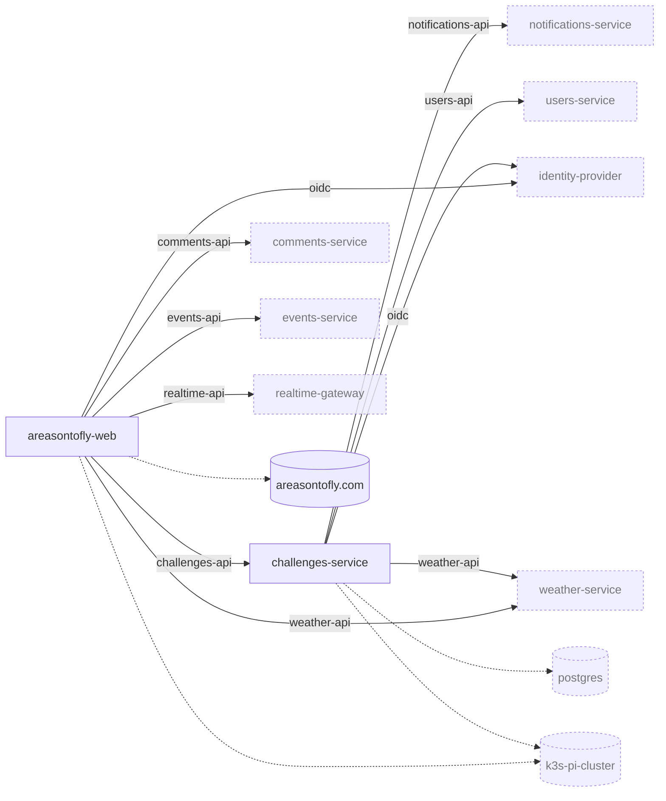
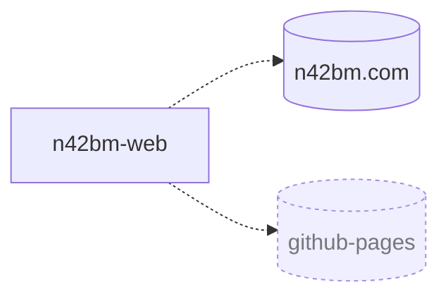
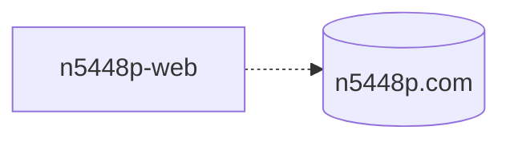
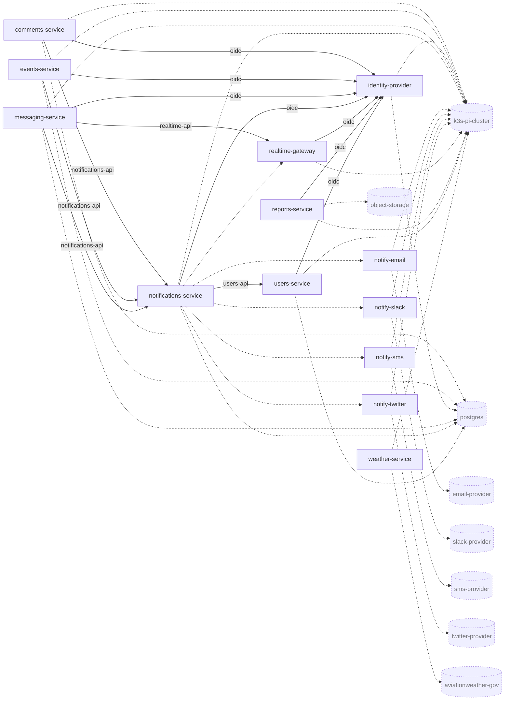
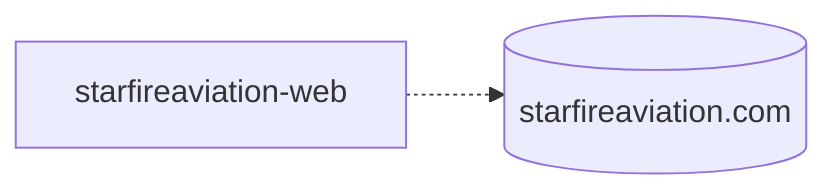
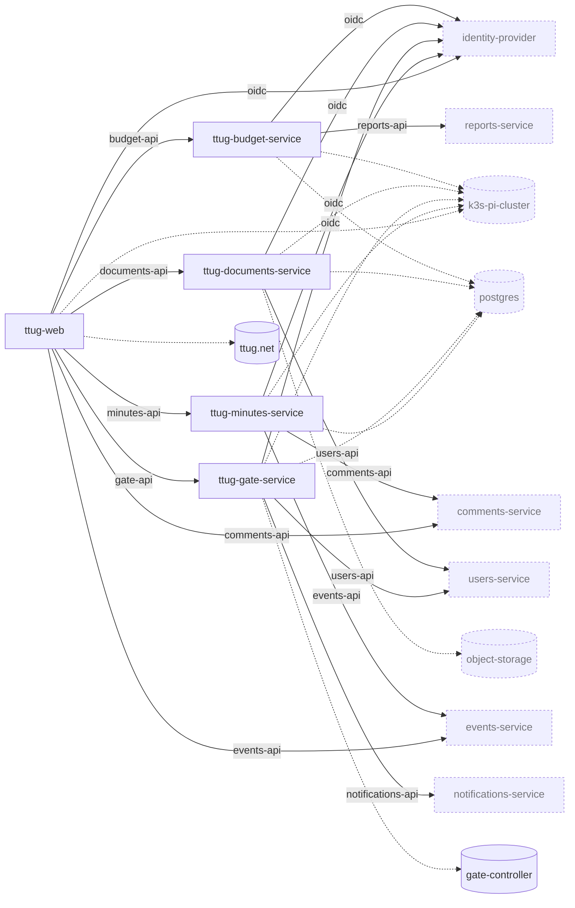

<!-- GENERATED by scripts/build_catalog.py; edit the YAML under catalog/, not this file -->

# Dependency graphs

Solid arrows: *consumes API of*. Dashed arrows: *depends on*. Nodes outside the system are shown with a dotted border.

## A Reason to Fly

## brianmichael.org

## N42BM

## N5448P

## Platform

## Starfire Aviation

## TTUG

