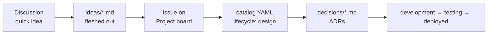

# Platform Catalog

Everything Brian builds or runs for the web, in one place.

- **[Dashboard](catalog/index.md)**: every component, API, resource and domain with status, language, runtime and dependencies.
- **[Dependency graphs](catalog/graphs.md)**: per-system view of who calls whom.
- **Systems**: each has an overview, an `ideas/` folder and a `decisions/` folder.
- **[Conventions](conventions.md)**: lifecycle definitions, naming, annotations.

## How ideas become running software

